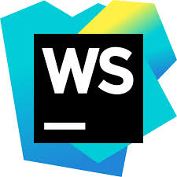
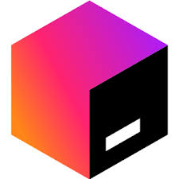

# SABBIR SHEIKH
### Android App Developer
 

  
  
  

 

### Love to code

  
  
  
  
  
  
  
  
  

---

### Favourite Tools

###  Open Source Contribution Going:
<table>
<tbody>
<tr>
<td>

</td>

<td>

</td>
</tr>

<tr>
<td>

</td>

<td>

</td>
</tr>

</tbody>

</table>

### About
Hi, my name is "Sabbir Sheikh". I am an Android developer, and I have been working in this sector for the past three years. Over this time, I have gained a lot of experience. Along with that, I am also a student.

---

### Working Area

1. Developing Android applications
2. Modifying source code
3. Releasing apps on the Google Play Console
4. Implementing in-app purchases and ads in the app

<table>
<tbody>

<tr>
<td>

</td>

<td>

</td>
</tr>

</tbody>
</table>

